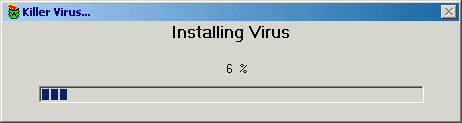



## Fake Viri \(win98\)

### Description

This program is great FAKE(!!!!!!!!!!!!) Virus Installer. Ir will make some hardrive noises.. then once it gets to 100% boom! blue screen 3 times, and freeze... This only works in win98, and i haven't tested it in winME...

anyway, the only way to stop it (before it gets to 100) is to click the % sign, not teh numbers, the actaul % sign...

have fun with this.. don't use it the wrong way.. by all means scare the hell outta your room mate or something, but don't take it to far!

vote!!! please...
 
### More Info
 
victims mouth agape

have MSCOMCTL.OCX on the computer to run it...

Comedy...

3 blue screens and a freeze

             |
---                |---
**Submitted On**   |2000-10-27 21:50:04
**By**             |[atwinda](https://github.com/Planet-Source-Code/PSCIndex/blob/master/ByAuthor/atwinda.md)
**Level**          |Intermediate
**User Rating**    |3.7 (11 globes from 3 users)
**Compatibility**  |VB 5\.0, VB 6\.0
**Category**       |[Jokes/ Humor](https://github.com/Planet-Source-Code/PSCIndex/blob/master/ByCategory/jokes-humor__1-40.md)
**World**          |[Visual Basic](https://github.com/Planet-Source-Code/PSCIndex/blob/master/ByWorld/visual-basic.md)
**Archive File**   |[CODE\_UPLOAD1101010282000\.zip](https://github.com/Planet-Source-Code/atwinda-fake-viri-win98__1-12344/archive/master.zip)

